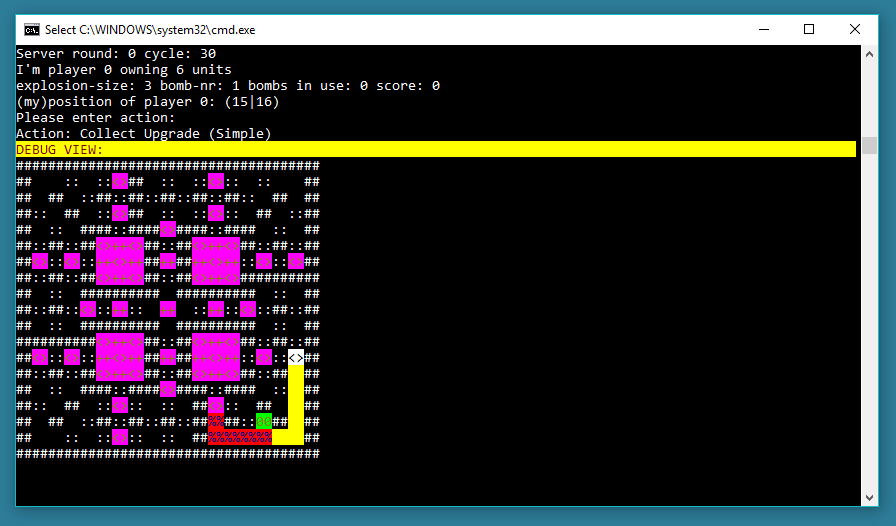

# bomberman-colors
Colorized ASCII Interpreter for MD.H Bomberman Exercise



The directory structure and base of the project were copied from Jakob Thomsen's and Christoph Minnameier's
bomberman AI exercise at [Mediadesign University of Applied Sciences](http://www.mediadesign.de/).
All other source code was based on code by the two of them for use in the MD.H C++ networking and AI lectures,
however much of the code was rewritten to clean up the project, adapt to newer C++ features and fix some bugs.

Lastly the Visual Studio project files were completely removed and replaced with CMake files that should allow
the source code to be buildable more easily with newer visual studio versions. I had some issues with VS 2019
already that seemed easier to fix with cleaning the project up a bit and converting it to a CMake project.

The network API is still fully compatible though, so the new server application will still work with old bots and vice versa.

## Files

The main project source code, C++ project, compiled executables and ppm-maps are in the 'bomber_clone_tcp' directory.
The 'external' directory contains all external third-party libraries (SDL and SDL_net).

## Dijkstra Map
I've added a [custom map](bomber_clone_tcp/dat/dijkstra.ppm) to specifically test bots for correct
implementation of Dijkstra pathfinding.


## Source Code
All custom code - that is code added or modified by the student or not included in the original
project - is located under 'src/custom'.

| bomer_clone_client | Modified client script that calls the colorized debugger |
|--------------------|----------------------------------------------------------|
| color_debug        | Main logic for colorized output                          |
| ctile              | Slightly modified tile class                             |
| defines            | Directions and PlayerControlTypes                        |
| vectorExtensions   | Adds a VectorContains() function which I used A LOT      |

## Dependencies/Third Party Code
The repository has embedded copies of SDL2 and SDL2_net which are located in bomber_clone_tcp/external.

## Building from Source
The original 

Required tools:
* Visual Studio 2019 with C++ tools
* CMake (can be installed alongside Visual Studio)

You can then create build files with:
```
cmake -S </path/to/bomber_clone_tcp/> -B </path/to/cmake_build/>
//e.g.
cmake -S ./bomber_clone_tcp -B ./cmake_build/
```
... and build the project with
```
cmake --build ./cmake_build/
```
Target architecture (x86 or x64) is detected automatically from your command line environment.
If you want to switch between Win32 and Win64 builds explicitly, you'll need to also supply the generator + architecture when creating build files:
```
cmake -S ./bomber_clone_tcp -B ./cmake_build_x86/ -G "Visual Studio 16 2019" -A Win32
cmake -S ./bomber_clone_tcp -B ./cmake_build_x64/ -G "Visual Studio 16 2019" -A x64
```

As mentioned above, the project requires SDL2 and SDL2_net, for which prebuilt Win32 and Win64 binaries were embedded.
For all other platforms you must make modifications to the CMakeLists files.
